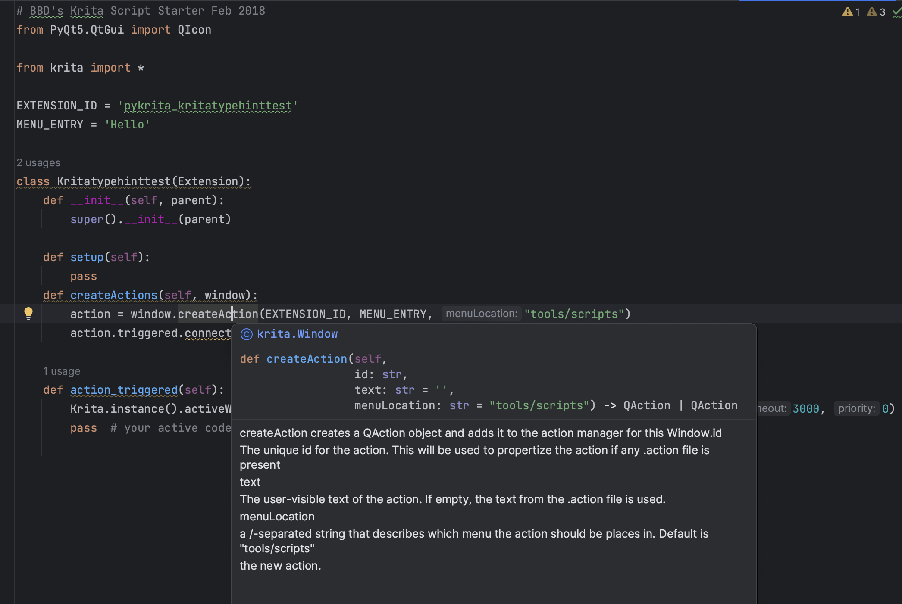

Python krita module stub file generated by C++ header and Doxygen, used for IDE auto complete, inspired by [scottpetrovic/krita-python-auto-complete](https://github.com/scottpetrovic/krita-python-auto-complete) but worked and generated for Krita 5.15.

# Usage

1. clone this repository.
2. copy the file `krita.pyi` into your plugin directory.
3. enjoy type-safety.

# "build" manually

1. download krita source code's `libs/libkis` directory, you can download it directly from [there](https://download-directory.github.io/?url=https%3A%2F%2Fgithub.com%2FKDE%2Fkrita%2Ftree%2Fmaster%2Flibs%2Flibkis)
2. download [doxygen](https://github.com/doxygen/doxygen/actions/workflows/build_cmake.yml) for xml documentation generation
3. cd to `libs/libkis`, run `doxygen -s -g` to generate Doxygen Configuration file
4. modify `Doxyfile`, set `GENERATE_XML` to `YES`
5. run `doxygen` to generate Xml documentation
6. modify `build.py`, setup variable `XML_PATH` and `PLUGIN_PATH` to corresponding path
7. run `python build.py`, then `krita.pyi` will be generated in `PLUGIN_PATH`

# TODO

- [ ] class comment format
- [ ] method comment format
- [ ] DockWidgetFactory is missing, and an enum within DockWidgetFactoryBase
- [ ] some method whose argument's type cannot be found are removed
